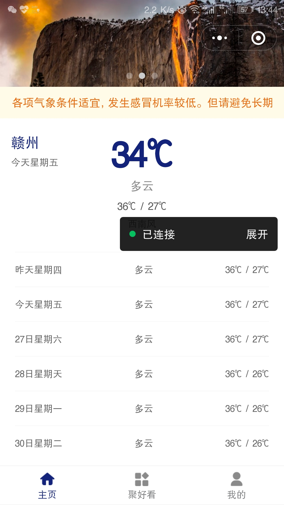
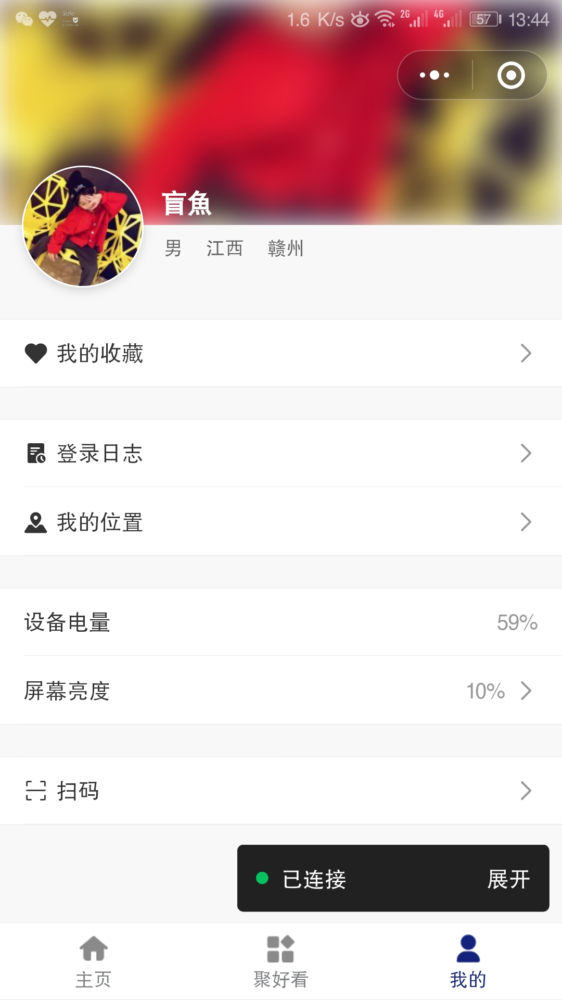
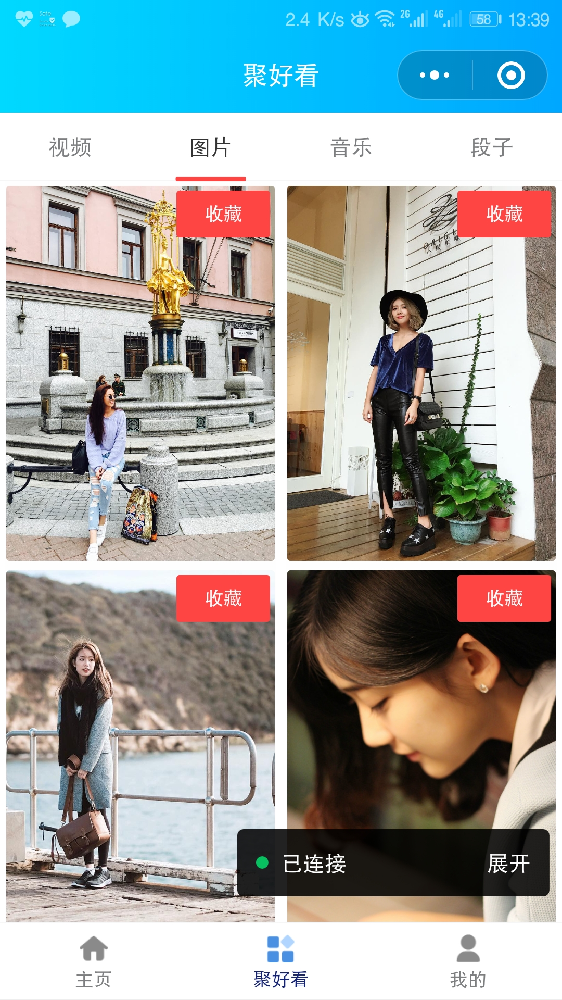
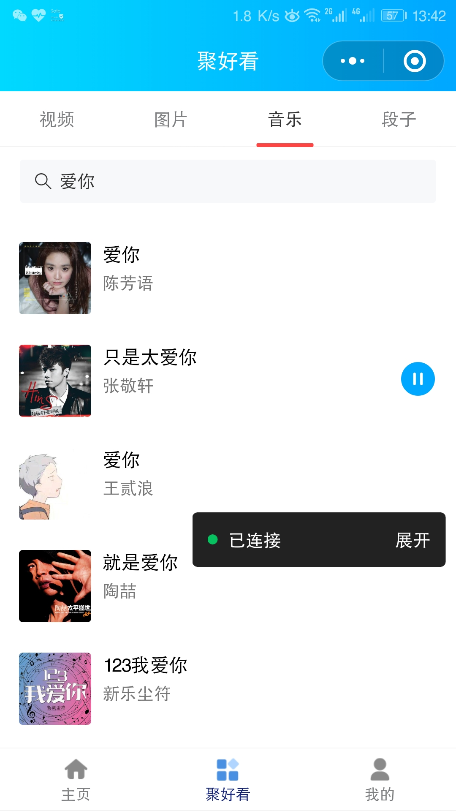

聚好看
===

基于mpvue的小程序

<div align="center">
    
	
	
</div>
<div align="center">
    
	
	
</div>

也还得感谢这位老哥（peakchao）提供的api，哈

说明
------
目前主要是针对微信小程序的开发，所以里面用了不少微信小程序原生的api，主要是为了深入学习小程序，后续如果需要移植到其他平台的小程序，需要分平台（mpvue很容易判断平台），根据不同平台走不同代码。


## Build Setup

``` bash
# 初始化项目
vue init mpvue/mpvue-quickstart myproject
cd myproject

# 安装依赖
yarn

# 开发时构建
npm dev

# 打包构建
npm build

# 指定平台的开发时构建(微信、百度、头条、支付宝)
npm dev:wx
npm dev:swan
npm dev:tt
npm dev:my

# 指定平台的打包构建
npm build:wx
npm build:swan
npm build:tt
npm build:my

# 生成 bundle 分析报告
npm run build --report
```